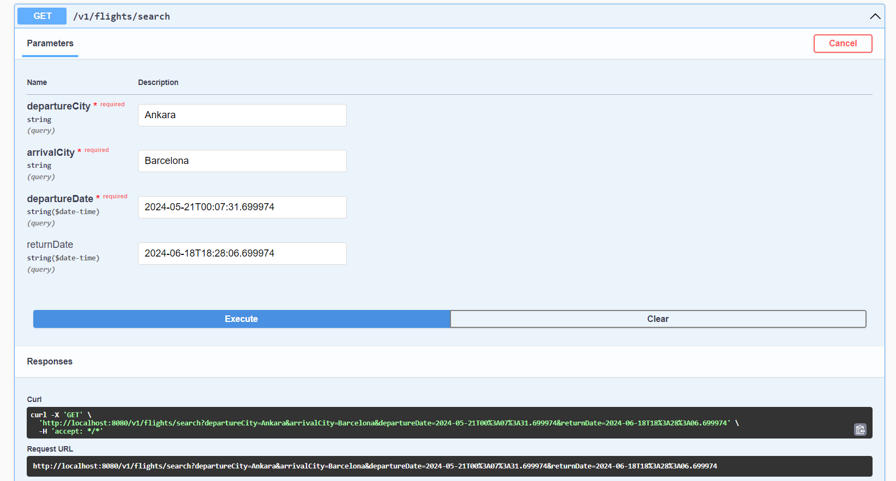
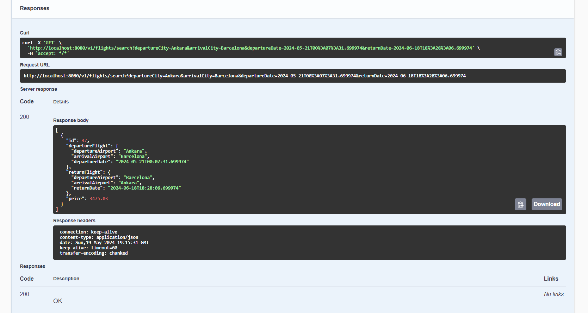
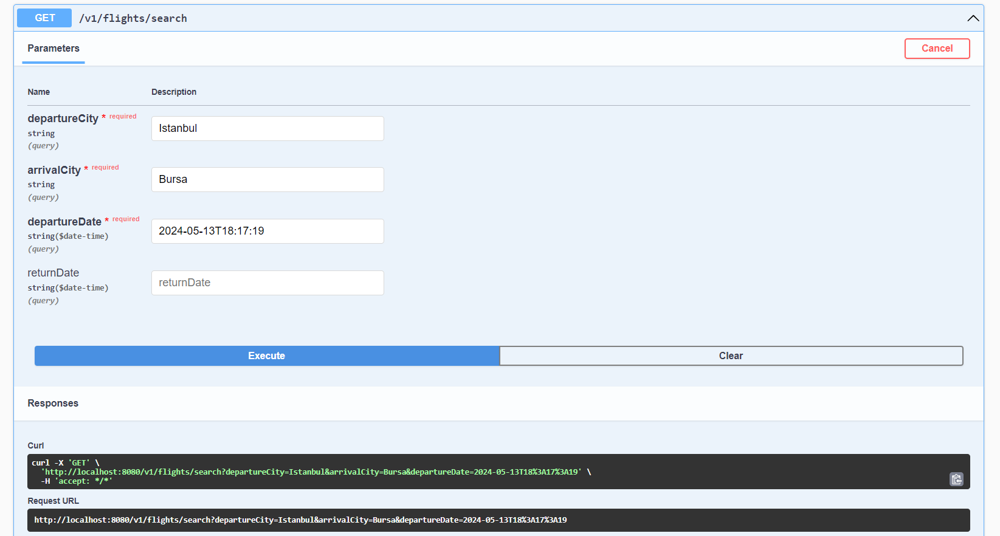
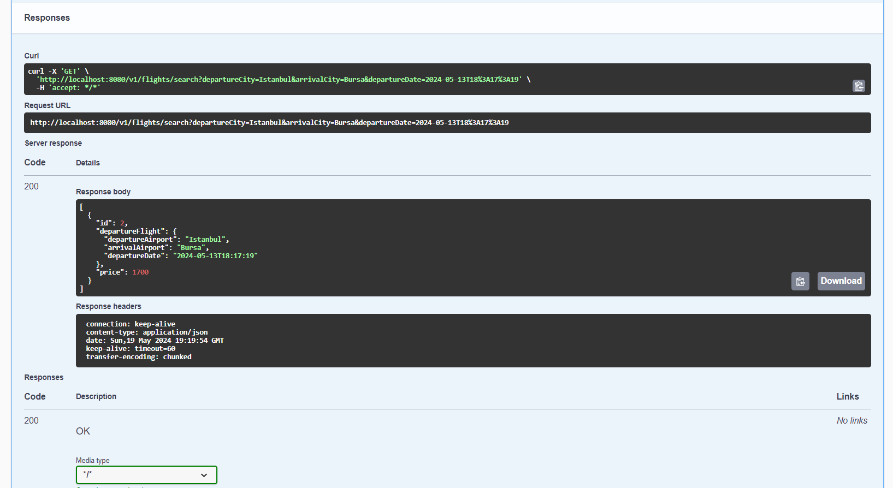

# Flight Search API

## Overview

Flight Search API is a Spring Boot application designed to provide a RESTful API for searching flights. The project leverages Spring Boot's ecosystem to facilitate development, including data persistence, web services, and OpenAPI documentation.

## Requirements

- Java 17
- Maven 3.6.3 or higher
- PostgreSQL database
- Data Modeling & CRUD
- REST API & Search API
- Documentation with Swagger UI

## Project Structure

### Dependencies

The project uses several dependencies to facilitate different functionalities:

- **Spring Boot Starters**
    - `spring-boot-starter-data-jpa`: For JPA and database interactions.
    - `spring-boot-starter-web`: To build web, including RESTful, applications using Spring MVC.
    - `spring-boot-devtools`: Provides development-time features.
    - `spring-boot-starter-test`: For testing the application.

- **Database**
    - `postgresql`: PostgreSQL database driver.

- **Others**
    - `lombok`: A Java library that helps reduce boilerplate code.
    - `spring-boot-docker-compose`: Enables Spring Boot application to interact with Docker Compose.
    - `springdoc-openapi-starter-webmvc-ui`: For generating OpenAPI documentation for the RESTful API.

## Endpoints:
### Airport-Controller
- /v1/airports/all **(GET)**
- /v1/airports/{id} **(GET)**
- /v1/airports **(POST)**
- /v1/airports/{id} **(PUT)**
- /v1/airports/{id} **(DELETE)**
### Flight-Controller
- /v1/flights/all **(GET)**
- /v1/flights/{id} **(GET)**
- /v1/flights **(POST)**
- /v1/flights/{id} **(PUT)**
- /v1/flights/{id} **(DELETE)**
- /v1/flights/search **(GET)**
### Mock-Controller
- /api/mock

## Search API
- An API endpoint should be made that lists flights that match the given departure location, destination, departure date and return date.
- If the return date is not given, it is a one-way flight; if it is given, it is a two-way flight.
- One flight information should be given for a one-way flight and two flight information should be given for a two-way flight.

